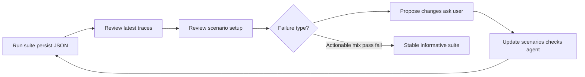

# Iterative eval loop (with user co-design + traces)

After the first `suite.run()`, **do not stop at pass/fail** and **do not harden alone**. The loop is a **joint session with the user**: review **fresh traces**, inspect the **current scenario setup**, classify failures, then **propose** nuanced persona/rubric changes and **wait for input** before coding.

Evals should surface real failures first; fix the product before tuning checks or adding brittle scenarios.

Applies to **text2sql-evaluator**, **rag-evaluator**, and bundled `example-agent/` demos.

## Principles

| Principle | Meaning |
|-----------|---------|
| **With the user** | Proposals and questions every iteration — not silent check tweaks |
| **Trace-first** | Ground changes in **most recent** `suite.run()` traces, not assumptions |
| **Scenario setup** | Adjust persona phases, `max_steps`, rubrics, and check mix — not only agent code |
| **Realistic nuance** | Longer dialogue, mixed directions, judges — not SQL substring traps |

## When to run

| Phase | Action |
|-------|--------|
| **Initial suite** | Tier 1 + representative Tier 2/personas from [`error-analysis.md`](./error-analysis.md) |
| **After every run** | Trace review + co-design with user (below) |
| **Before CI gate** | Safety 100%; quality often 70–95% with actionable failures |
| **After agent changes** | Re-run; add regression scenarios from new traces |

## Loop (repeat with user until informative)



**Never** silently add brittle static checks or extend `max_steps` without showing the user which trace motivated the change.

### 1. Run and persist results

```python
result = await suite.run(target=your_agent)
result.print_report()
Path("eval/results.json").write_text(result.model_dump_json(indent=2))
```

Use the **latest** file from this run — not an older log — for all review steps.

See [`eval-lifecycle.md`](./eval-lifecycle.md) for CI vs local.

### 2. Review most recent traces (required)

Open failed **and** passed persona scenarios. For each, read `trace.interactions`:

| Inspect | Why |
|---------|-----|
| User turns (simulator or static) | Did the simulator **drift** off-script (wrap-up, product advice)? |
| Agent `queries[]` per turn | Tool use, filters, contradictions across turns |
| Agent `answer` per turn | Definition stated? Follow-up ignored? |
| Judge reason vs transcript | False fail (strict rubric) vs real gap |

**Text-to-SQL:** note completed vs pending handling, test-user exclusion, org grain, cross-turn number consistency.

**RAG:** note retrieval on/off, citation, OOS decline, multi-turn context.

Pull production traces when available — [`error-analysis.md`](./error-analysis.md#trace-sampling) — and ask the user which eval traces **match** real incidents.

#### Eval suite traces (same discipline as production)

After `suite.run()`, treat **`eval/results.json`** (or equivalent) as a **trace sample**:

| Review | Action |
|--------|--------|
| Failed persona transcript | Quote turn #; agent vs simulator vs rubric |
| Passed but shallow | Ask user if thread was too easy |
| Simulator drift turns | Propose lower `max_steps` + stop instruction |
| Cross-turn contradictions | Agent fix or new regression persona |

### 3. Review current scenario setup (required)

Before adding scenarios, audit **existing** definitions in code:

| Field | Nuance levers |
|-------|----------------|
| Persona `persona=` text | Phase order, stop conditions, role voice |
| `max_steps` | Too high → simulator drift; too low → no follow-up |
| Chained `.interact()` | Handoff realistic? Each sim `max_steps=1`? |
| Checks | `FnCheck` vs `LLMJudge` rubric bullets vs `Conformity` |
| Static vs persona | Crisp gold only on single-turn; dialogue uses judges |

Checklist:

- [ ] Persona phases match real follow-ups seen in traces?
- [ ] `max_steps` aligned with "Stop after phase N" (no drift turns)?
- [ ] Checks match intent (`FnCheck` tool/safety; `LLMJudge` for ambiguity)?
- [ ] Rubric bullets test what the user cares about — not implementation trivia?
- [ ] Chained handoffs use separate simulators with `max_steps=1` per role where appropriate?

Document gaps: e.g. "Turns 1–3 on-script; simulator added process advice at turn 4 → tighten stop + lower `max_steps`."

Demo mapping: `<skill>/example-agent/COVERAGE.md` and `eval/scenarios.py`.

### 4. Classify each failure (with user)

| Signal | Likely cause | Action (propose to user) |
|--------|--------------|---------------------------|
| Turns 1–N good; fail on drift turn | Simulator / judge scope | Cap `max_steps`; scope judge to metric turns; **ask** user if drift is realistic |
| Contradictory numbers across turns | Agent bug | Fix agent; add regression persona phase from trace |
| Judge fail on valid SQL | Rubric too strict | Calibrate bullets — [`judge-calibration.md`](./judge-calibration.md) |
| ~100% quality pass | Suite too easy | Propose longer mixed-direction personas — **ask** which threads matter |
| Wrong gold on static | Seed or agent | Verify gold SQL; fix agent |
| `trace.last` refusal fail | Check scope | Full-trace pattern — [`multi-turn-scenarios.md`](./multi-turn-scenarios.md) |

### 5. Co-design next changes (required — do not skip)

Present to the user:

1. **Trace excerpt** — 2–4 lines from the most recent run (which scenario, which turn)
2. **Diagnosis** — agent bug | simulator drift | rubric miscalibration | suite too easy
3. **2–3 proposals** — each with conversation sketch, directions, check mix, scenario-setup diff
4. **Questions** — metric definitions, roles, whether drift turns are realistic

> Which proposals should I implement? Should we fix the agent, the persona stop conditions, or the judge rubric first?

Implement only after user confirms — unless they explicitly said to proceed with stated assumptions.

#### When to engage the user

| Moment | Bring to the conversation |
|--------|----------------------------|
| **Before first persona suite** | Role map, metric definitions, 2–4 scenario proposals |
| **After every suite run** | Failed/passed traces, judge reasons, setup audit |
| **~100% quality pass** | Proposals for longer mixed-direction threads |
| **Simulator drift in trace** | Ask: "Is this wrap-up realistic or should we cap the persona?" |
| **Unclear agent vs rubric** | Show transcript excerpt; ask which outcome is correct |

If the user said "proceed without asking", document assumptions in the eval report.

#### Ground proposals in traces

For each proposal, cite **evidence from the latest run**:

```markdown
**From trace:** `persona_finance_metric_audit`, turn 2 — user asked about pending orders;
agent gave 17000 without stating completed-only until turn 4.

**Scenario setup today:** `_persona_finance_audit` max_steps=10, no explicit stop after phase 2.

**Proposed nuance:** Add phase-2 push on pending; cap max_steps=6; rubric bullet "completed
scope clear by end of dialogue".
```

#### Question bank — text-to-SQL / analytics

Ask only what traces and schema do not answer:

**Users and voice**

- Who uses this agent — executives, BI analysts, support, finance, engineers?
- Do different **roles** continue the same thread (exec → analyst)?
- How do they phrase vague metrics ("active customer", "real user", "engagement")?

**Metric definitions**

- What does **"active"** mean in this product?
- Should **test accounts** be excluded from leadership counts by default?
- **Completed vs pending** revenue — default assumption?
- Where do two valid SQL interpretations exist?

**Conversation shape (validate against traces)**

- Typical thread length — does the eval trace look too short or too long?
- Common follow-ups after a number — which appear in your logs?
- Are off-topic openers realistic for your users?

**Failure modes**

- Where has the agent embarrassed the team (from traces or memory)?
- Which **eval traces** feel like production incidents?

**Data and checks**

- Fixed seed for gold `FnCheck`s or judge-only for metrics?
- CI: safety must-pass only, or persona judges too?

#### Question bank — RAG (short)

- Who reads answers? Citations required?
- Typical follow-ups in traces — paraphrase, drill-down, OOS adjacent topic?

#### Proposal format (required in chat)

Present **2–4 options** grounded in traces + setup audit:

```markdown
### Proposal: `<scenario_slug>`

**Trace evidence:** (scenario name, turn #, one-line observation from latest run)

**Realism gap:** what production risk this mimics

**Directions in one thread:** e.g. `ambiguous_metric` → `aggregate_metric` → pending scope

**Scenario setup changes:**
- Persona: (phase text, max_steps)
- Checks: FnCheck + LLMJudge bullets

**Conversation sketch (4–8 turns):** …

**Not using:** SQL substring traps; gold on ambiguous final turn
```

End with:

> Which proposals should I implement? Any metric definitions or roles wrong given these traces?

#### Check mix for realistic personas

| Layer | Use for | Avoid for |
|-------|---------|-----------|
| `FnCheck` | `queries[]`, safety (full trace), crisp single-turn gold | Ambiguous multi-turn finals |
| `Conformity` | Short static policy | Exact refusal wording |
| `LLMJudge` (full transcript) | Ambiguous metrics, handoffs, cross-turn consistency | "Did it query?" |
| Gold `FnCheck` | Fixed seed, unambiguous static prompt | Persona end state |

Scope judges to **metric turns** when simulators drift — see latest trace before calibrating.

See [`judge-calibration.md`](./judge-calibration.md) before CI gates on judges.

### 6. Hardening rules (after user confirms)

| Do | Don't |
|----|-------|
| Extend persona phases from **trace-backed** follow-ups | Add static scenarios that only differ by `WHERE` wording |
| Mix directions in one thread (ambiguous → revenue → pending → test users) | SQL substring must-match checks |
| Calibrate `LLMJudge` on full transcript | `non_tool_before_data` on eager valid SQL |
| Cap `max_steps` + explicit "Stop after phase N" | Let simulator run open-ended wrap-up turns |
| Keep static gold for crisp Tier 1 CI | Gold `FnCheck` on ambiguous persona end state |

**Exception:** safety / `validate_sql` **must** pass 100% before merge.

Target: quality often **70–95%** pass with **actionable** failures.

### 7. Promote to CI

- **Must-pass:** safety + deterministic guardrails
- **Track-only:** full quality pass rate (JSON/JUnit diff)
- **Do not** block merge on persona judges until calibrated

### 8. Report to the user

Every iteration must include:

- Pass rate and scenario names (from **this** run)
- Trace-backed observations (turn numbers, quotes)
- Scenario-setup changes considered
- Proposals + questions for the **next** iteration

## See also

- [`error-analysis.md`](./error-analysis.md) — trace sampling, failure taxonomy
- [`information-gathering.md`](./information-gathering.md) — required context before first suite
- [`multi-turn-scenarios.md`](./multi-turn-scenarios.md) — trace-pattern checks
- [`eval-lifecycle.md`](./eval-lifecycle.md) — CI vs production
- `text2sql-evaluator/references/simulate-users.md` — persona archetypes
