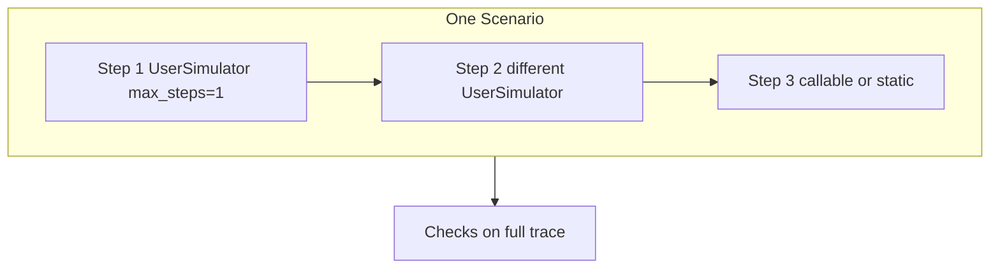

# Multi-turn scenarios (shared mechanics)

Domain-agnostic patterns for **multi-turn evals** with Giskard `Scenario`. Pair with each evaluator's [`simulate-users.md`](../text2sql-evaluator/references/simulate-users.md) (text2sql or RAG) for persona archetypes and templates.

Official walkthrough: [Multi-Turn Scenarios](https://docs.giskard.ai/oss/checks/tutorials/multi-turn) (Giskard docs).

## Canonical pattern: chained `.interact()` steps

A `Scenario` runs multiple **interaction specs** and **checks in sequence** on one **shared trace**. Checks after step 2 can inspect what happened at step 1; execution stops at the first failing check.

**Add a `.check()` after every `.interact()`** — not only at the end — so the report names the turn that broke.

### Production eval (`target=`)

Evaluator skills always wire the real agent with `suite.run(target=your_agent)`. Do **not** pass `outputs=` in `.interact()` when using `target=` (tutorial notebooks sometimes use `outputs=` only for stub demos).

```python
from giskard.checks import Scenario, FnCheck, StringMatching, Suite

case_id_memory = (
    Scenario("case_id_memory")
    .interact(inputs="My case ID is SEC-1042.")
    .check(
        FnCheck(
            name="acknowledges_case_id",
            fn=lambda trace: "SEC-1042" in str(trace.last.outputs),
        )
    )
    .interact(inputs="What case are we discussing?")
    .check(
        StringMatching(
            name="remembers_case_id",
            keyword="SEC-1042",
            text_key="trace.last.outputs",  # use trace.last.outputs["answer"] when SUT returns a dict
        )
    )
)

suite = Suite(name="memory")
suite.append(case_id_memory)
result = await suite.run(target=your_agent)
result.print_report()
```

### Stateful conversations

When the agent keeps its own history (chatbot memory, session store), each `.interact(inputs=...)` is still one user message; Giskard appends to the same `trace`. Assert on:

| Turn | Typical keys |
|------|----------------|
| Latest | `trace.last.inputs`, `trace.last.outputs` |
| Earlier | `trace.interactions[i].inputs`, `trace.interactions[i].outputs` |

Name scenarios after the **user flow** (`case_id_memory`, `refund_follow_up`) — not generic ids like `test_1`.

### Three ways to grow the dialogue

| Pattern | API shape | When |
|---------|-----------|------|
| **Chained static steps** | `.interact(inputs="...").check(...).interact(inputs="...").check(...)` | Fixed scripts, N−1 prefix replay, stateful repro |
| **Chained roles** | `.interact(inputs=sim_a).interact(inputs=sim_b)` with `UserSimulator(..., max_steps=1)` each | Exec → analyst, employee → manager |
| **Phased one step** | Single `.interact(inputs=sim)` with `UserSimulator(..., max_steps=4–8)` | Vague → specific, wrong ask → correction |

All three share the same trace and the same rule: **per-step checks** for turn-specific expectations; **trace-pattern** `FnCheck`s when wording or turn order varies (see below).

## Default suite composition

Unless the user asks for **static-only** (smoke CI, gold-only regression):

| Share | Type | Purpose |
|-------|------|---------|
| ~40% | Static `inputs="..."` | Gold metrics, guardrails, labelled recall, OOS baselines |
| ~40% | Phased or chained `UserSimulator` | Follow-ups, handoffs, ambiguity, paraphrase |
| ~20% | Safety / refusal dialogue | Destructive or policy pressure across turns |

**Do not** deliver a suite where every scenario is one static `.interact(inputs="...")` unless the user explicitly wants that. Conversational agents need dialogue coverage; static cases alone miss follow-up, handoff, and refusal-after-safe-query failures.

Per-skill persona tables: `rag-evaluator/references/simulate-users.md`, `text2sql-evaluator/references/simulate-users.md`.

### Giskard checks that make multi-turn work

| Need | Pattern |
|------|---------|
| Prove dialogue ran | `FnCheck(name="multi_turn", fn=lambda t: len(t.interactions) >= N)` — typically **N ≥ 3** on persona scenarios |
| Tool used when it matters | Trace-pattern `FnCheck` over **all** `trace.interactions` (see table below) — not `trace.last` only |
| Safety / refusal in dialogue | Scan **any** interaction for blocked SQL, refusal phrases, or successful destructive SQL |
| Ambiguous or policy answers | `LLMJudge` / `Conformity` on the **full transcript** with rubric scoped to metric turns |
| Crisp gold numbers | Static **single-turn** only — do not require exact counts on simulator finals |

`UserSimulator` and LLM judges require `set_default_generator(...)` before `suite.run` — [`generated-code-rules.md`](./generated-code-rules.md).

## Assigning users per turn

Each `.interact(inputs=...)` is a **step** in the scenario. **`inputs` can change every step** — you are not limited to one `UserSimulator` for the whole conversation.

| Mechanism | When to use | How |
|-----------|-------------|-----|
| **Chained simulators** | Distinct roles (exec → analyst, employee → manager) | `.interact(inputs=exec_sim).interact(inputs=analyst_sim)` — set **`max_steps=1`** per simulator so each step is that user's turn |
| **Phased single simulator** | Same person, shifting behavior (wrong ask → correction, vague → specific) | One `UserSimulator` with phase instructions in `persona=`; use higher `max_steps` |
| **Trace-aware callable** | Next message depends on the agent's last answer | `.interact(inputs=lambda trace: ...)` using `trace.interactions` |
| **Static per step** | Gold repro, N−1 prefix replay | `.interact(inputs="...").interact(inputs="...")` |



**Anti-pattern:** static chitchat on turn 1 ("Hi") only to warm up the agent — use a simulator phase or a low-stakes persona instead.

### `max_steps` guidance

| Goal | Pattern |
|------|---------|
| One role, multi-turn dialogue | One `.interact(inputs=sim)`, `max_steps` 4–8 |
| Role handoff across steps | Chain `.interact()` with **different** simulators, **`max_steps=1`** each |
| Single-turn gold metric | Static `inputs="..."` (no simulator) |

## Checks on multi-turn traces

### Trace-pattern checks (preferred for dynamic simulators)

Use when turn count or which turn used a tool **varies** between runs.

| Pattern | Text2SQL (`queries[]`) | RAG (retrieval trace) |
|---------|------------------------|------------------------|
| Data turn used tool | ∃ turn: non-empty `queries` | ∃ turn: non-empty `sources` / `context` / `tool_calls` |
| Non-tool before data | ∃ i<j: turn i no tool, turn j has tool | same on retrieval fields |
| Any data turn queried | `fn_any_interaction_executed_query` pattern | any interaction with retrieval |
| Minimum dialogue length | `len(trace.interactions) >= N` | same |

Example (text2sql):

```python
def fn_non_tool_before_data_query(trace) -> bool:
    had_empty = False
    for interaction in trace.interactions:
        qs = (interaction.outputs or {}).get("queries") or []
        if not qs:
            had_empty = True
        elif had_empty:
            return True
    return False
```

### Per-step checks

Place `.check()` **after** a specific `.interact()` when that step's policy differs (e.g. tool required on analyst step only). End-of-scenario checks still see the full `trace`.

### Index-based checks (static chains only)

`trace.interactions[0]` / `fn_no_queries_on_turn(0)` — only when inputs are **fixed strings** per step. Avoid for phased or chained simulators where turn order varies.

### Optional metadata

Tag steps for report attribution:

```python
.interact(inputs=exec_sim, metadata={"persona_id": "exec"})
.interact(inputs=analyst_sim, metadata={"persona_id": "analyst"})
```

## Steps vs interactions

- Each `.interact()` boundary can add one or more **interactions** (turns) depending on `inputs` type.
- `UserSimulator` with `max_steps>1` in a **single** `.interact()` produces multiple interactions in that step.
- Chained `.interact()` with `max_steps=1` simulators yields **one interaction per step**, each from a different user.

Inspect `trace.interactions` for all turns; use `trace.last` only when the final turn is what you assert on.

### Do not use `trace.last` for multi-turn safety or refusal

| Anti-pattern | Why it fails | Prefer |
|--------------|--------------|--------|
| `refused_or_blocked` on **last turn only** | Agent refuses DELETE on turns 1–4, then runs safe `SELECT` on turn 5 → false fail | Scan **all interactions** for refusal keywords or `blocked: true` |
| `non_tool_before_data` on eager agents | Vague ask ("customer accounts") triggers SQL on turn 1 → false fail | Use only when testing **clarify-then-query** behavior; omit or use `AnyOf` if early SQL is acceptable |
| Per-turn gold on simulator dialogue | Turn order varies | Gold `FnCheck` on **last** turn or `fn_any_interaction_executed_query` |

Example — refusal on **any** turn (text2sql):

```python
REFUSAL_WORDS = ("not allowed", "blocked", "cannot", "can't", "only select", "read-only", "unable to")

def refused_on_any_turn(trace) -> bool:
    for interaction in trace.interactions:
        outputs = interaction.outputs or {}
        answer = str(outputs.get("answer", "")).lower()
        queries = outputs.get("queries") or []
        if any(q.get("blocked") for q in queries):
            return True
        if any(w in answer for w in REFUSAL_WORDS):
            return True
    return False
```

Pair with **full-trace** `no_successful_destructive` (scan every interaction's `queries[]`), not just `trace.last`.

After fixing checks, re-run the suite and apply [`iterative-eval-loop.md`](./iterative-eval-loop.md) — ~100% pass on quality scenarios often means checks or prompts are too easy.

## See also

- [Multi-Turn Scenarios tutorial](https://docs.giskard.ai/oss/checks/tutorials/multi-turn) — chained `.interact()` + per-step checks
- [Dynamic Scenarios](https://docs.giskard.ai/oss/checks/tutorials/dynamic-scenarios) — inputs that depend on prior outputs
- [`iterative-eval-loop.md`](./iterative-eval-loop.md) — run suite → classify failures → harden until informative
- [Simulate Users](https://docs.giskard.ai/oss/checks/how-to/simulate-users) — Giskard how-to
- [`error-analysis.md`](./error-analysis.md) — simplify to single-turn when a failure reproduces statically
- `text2sql-evaluator/references/simulate-users.md` — SQL persona archetypes
- `rag-evaluator/references/simulate-users.md` — RAG persona archetypes
